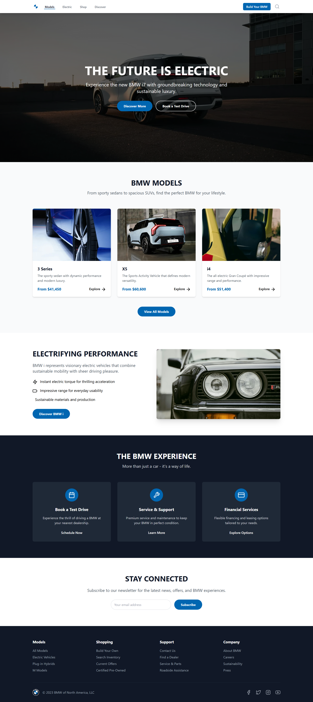

# BMW Website (Static)

Simple static website for a BMW-themed project. This repository contains a minimal HTML/CSS site you can open locally or serve with a lightweight static server.

## Contents

- `index.html` — The homepage HTML file.
- `style.css` — Main stylesheet for the site.
- `README.md` — This file.

## Quick local preview

You can open the site directly in your browser by double-clicking `index.html` or from the command line.

On Windows (PowerShell), from the project root run:

```powershell
Start-Process index.html
```

If you prefer to run a local HTTP server (recommended for testing relative paths and fetch requests), you can use Python (if installed):

```powershell
# Start a simple HTTP server on port 8000
python -m http.server 8000
# Then open http://localhost:8000 in your browser
```

Or, if you have Node.js installed, use the `http-server` package:

```powershell
# Install once (if needed)
npm install -g http-server
# Serve current directory
http-server -p 8000
```

## Development notes

- This is a static site — no build step is required.
- Edit `index.html` and `style.css` to change content and styles.

## Screenshots


```markdown

```

You can add multiple images and a short caption for each. If you'd like, I can create a `screenshots/` folder and add placeholder images — tell me whether to proceed.

If you'd like, I can:

- Add a simple favicon and meta tags for better mobile support.
- Add a minimal GitHub Pages setup or a small dev server script.
- Improve accessibility and responsive layout in `style.css`.

Tell me which of those you'd like next.
